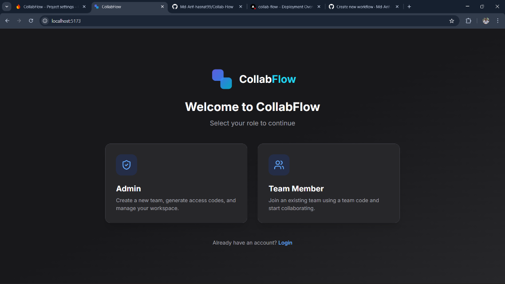
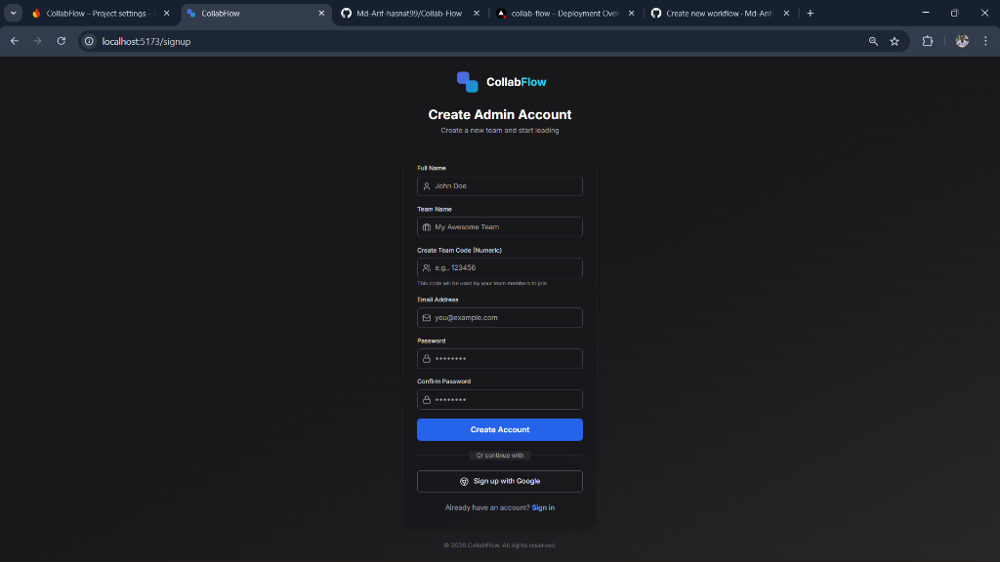
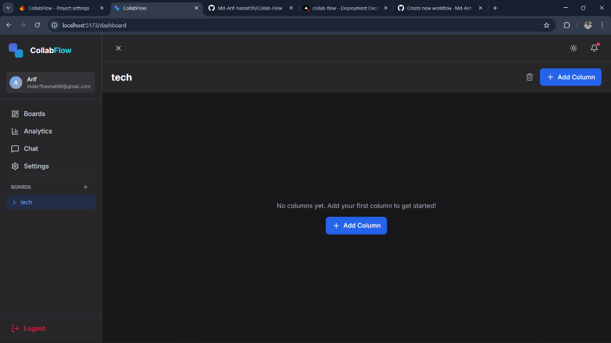
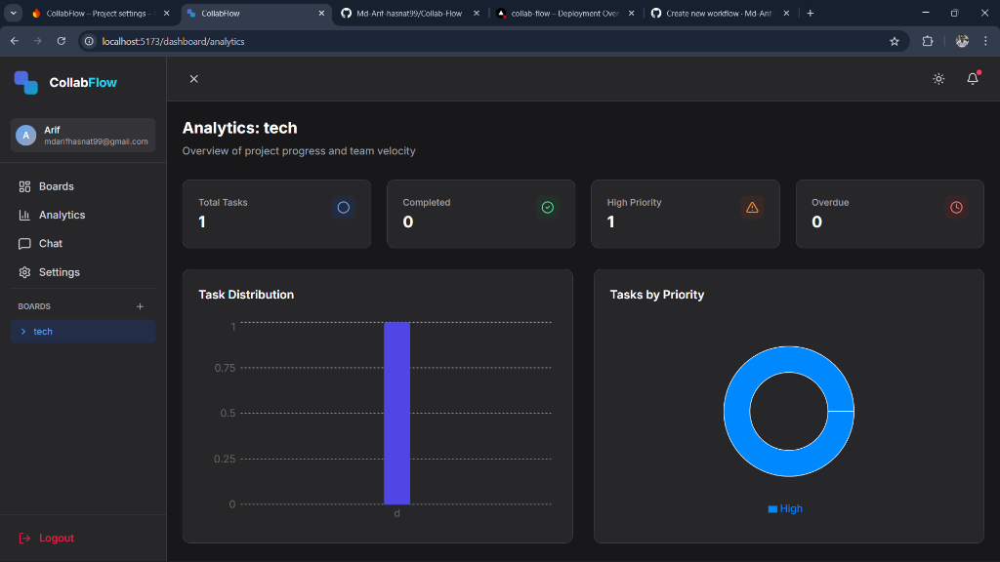
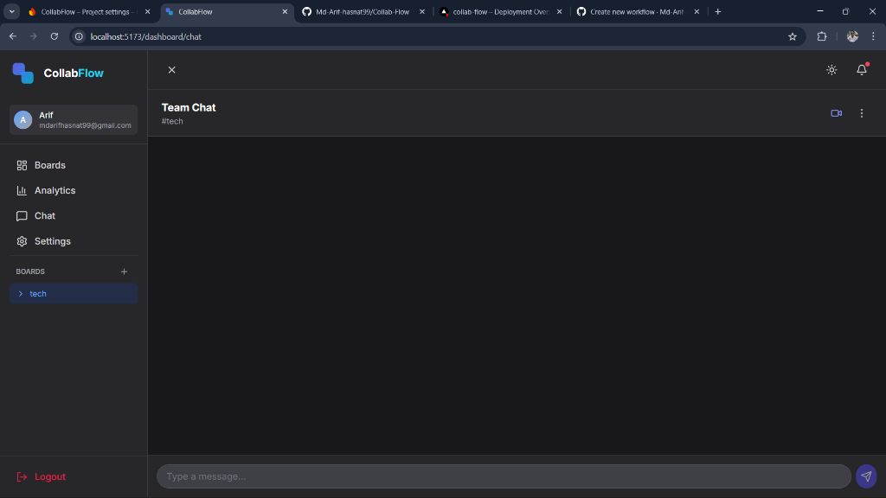

# CollabFlow

<div align="center">
  
  <br/>
  <h1>CollabFlow</h1>
  <h3>The Ultimate Remote Team Collaboration Workspace</h3>
  <p>
    A powerful, real-time Kanban project management tool designed to streamline workflows for distributed teams.
    <br />
    Built with modern web technologies for performance and scale.
  </p>

  <div align="center">
    
    
    
    
    
  </div>
  
  <br />

</div>

<details>
  <summary><strong>Table of Contents</strong></summary>
  <ol>
    <li><a href="#about-the-project">About The Project</a></li>
    <li><a href="#key-features">Key Features</a></li>
    <li><a href="#tech-stack">Tech Stack</a></li>
    <li>
      <a href="#getting-started">Getting Started</a>
      <ul>
        <li><a href="#prerequisites">Prerequisites</a></li>
        <li><a href="#installation">Installation</a></li>
        <li><a href="#firebase-setup">Firebase Setup</a></li>
      </ul>
    </li>
    <li><a href="#usage">Usage</a></li>
    <li><a href="#roadmap">Roadmap</a></li>
    <li><a href="#contributing">Contributing</a></li>
    <li><a href="#license">License</a></li>
    <li><a href="#contact">Contact</a></li>
  </ol>
</details>

---

## 🌟 About The Project

**CollabFlow** is more than just a Kanban board; it's a synchronous collaboration platform built to aid remote teams in managing tasks efficiently. In an era where distributed work is the norm, CollabFlow enables teams to stay aligned without the friction of constant status meetings.

We focused on three core pillars during development:

- **Speed**: Instant updates across all clients. No refreshing required.
- **Simplicity**: A clean, intuitive interface that doesn't overwhelm the user.
- **Scalability**: Built on Firebase to handle teams of any size.

Whether you are a solo developer tracking personal projects or a startup team managing your sprint, CollabFlow provides the structure you need.

## 🎨 Product Demo

<div align="center">
  <h3>Landing & Role Selection</h3>
  
  <br/><br/>

  <h3>Authentication</h3>
  
  <br/><br/>

  <h3>Project Board</h3>
  
  <br/><br/>

  <h3>Analytics Dashboard</h3>
  
  <br/><br/>

  <h3>Team Chat</h3>
  
</div>

---

## 🚀 Key Features

### ✅ Core Functionality (Implemented)

#### 📋 Interactive Kanban Board

- **Drag & Drop Interface**: Smooth, accessible drag-and-drop actions powered by `@dnd-kit` allows you to move tasks between stages effortlessly.
- **Dynamic Columns**: Create custom workflows. Add columns like "Backlog," "Development," "Testing," and "Deployed" to match your team's process.
- **Visual Organization**: Color-coded columns and tags help visual learners grasp the state of the project instantly.

#### ⚡ Real-Time Synchronization

- **Instant Updates**: Powered by Cloud Firestore's real-time listeners. When a teammate moves a card, you see it move instantly on your screen.
- **Optimistic UI**: Interactions feel immediate, with background syncing handling the data persistence ensuring a lag-free experience.

#### 🔐 Secure Authentication & User Management

- **Multiple Sign-In Methods**: Support for Email/Password and Google OAuth via Firebase Authentication.
- **Persistent Sessions**: Users stay logged in, and their state is protected across page reloads.
- **Role-Based Access**: Granular control over who can create boards vs. who can just edit tasks (Admin/Member roles).

#### 📝 Task Details & Management

- **Rich Task Modals**: Click any task to view comprehensive details.
- **Checklists**: Break down complex tasks into sub-tasks with progress bars.
- **Priority Levels**: Set Low, Medium, or High priorities with distinct visual indicators.
- **Due Dates**: Set deadlines and get visual warnings when tasks are overdue or approaching due date.
- **Tagging System**: Organize tasks by category, feature, or team using customizable tags.

### 🚧 Upcoming Features (Roadmap)

- **Team Chat**: Integrated per-board chat rooms.
- **Analytics Dashboard**: Velocity charts and burndown metrics.
- **Activity Logs**: A history of who did what and when.
- **Attachment Support**: Drag & drop file uploads to tasks.

---

## 🛠️ Tech Stack

This project uses the best-in-class tools for modern React development.

| Technology           | Purpose                                              |
| :------------------- | :--------------------------------------------------- |
| **react** (v18+)     | UI Library with Hooks & Functional Components        |
| **typescript**       | Static Type Checking for robust code                 |
| **vite**             | Next Generation Frontend Tooling (Super fast builds) |
| **firebase**         | Backend-as-a-Service (Auth, Firestore, Hosting)      |
| **tailwindcss**      | Utility-first CSS framework for styling              |
| **@dnd-kit**         | Lightweight & accessible drag-and-drop toolkit       |
| **lucide-react**     | Beautiful & consistent icon set                      |
| **react-router-dom** | Client-side routing                                  |
| **react-hot-toast**  | Elegant toast notifications                          |

---

## 📂 Folder Structure

A quick look at the top-level files and directories you'll see in this project.

```
CollabFlow/
├── .github/             # GitHub Actions workflows
├── node_modules/        # Project dependencies
├── public/              # Static assets (favicons, images)
├── src/
│   ├── assets/          # SVG assets and global styles
│   ├── components/
│   │   ├── Auth/        # Authentication forms (Login, Signup)
│   │   ├── Board/       # Complex Kanban board components
│   │   ├── Chat/        # Chat interface components
│   │   ├── Common/      # Reusable UI atoms (Buttons, Icons)
│   │   └── Layout/      # Main app dashboard layout
│   ├── contexts/        # React Contexts (Auth, Board, Theme)
│   ├── hooks/           # Custom React hooks
│   ├── lib/             # Firebase configuration
│   ├── pages/           # High-level page views (Analytics, Settings)
│   ├── types/           # TypeScript interface definitions
│   ├── utils/           # Helper functions
│   ├── App.tsx          # Main application component
│   └── main.tsx         # Entry point
├── .env                 # Environment variables (git-ignored)
├── .env.example         # Example environment variables
├── .firebaserc          # Firebase project aliases
├── firestore.rules      # Firestore security rules
├── storage.rules        # Storage security rules
├── index.html           # HTML entry point
├── package.json         # Project metadata and scripts
├── tailwind.config.cjs  # Tailwind CSS configuration
├── tsconfig.json        # TypeScript configuration
└── vite.config.ts       # Vite bundler configuration
```

---

## 🏁 Getting Started

Follow these instructions to set up your development environment.

### Prerequisites

Ensure you have the following installed:

- **Node.js** (v18.0.0 or higher)
- **npm** (v9.0.0 or higher) or **yarn**
- **Git**

### Installation

1.  **Clone the Repository**

    ```bash
    git clone https://github.com/Md-Arif-hasnat99/Collab-Flow.git
    cd CollabFlow
    ```

2.  **Install Dependencies**

    ```bash
    npm install
    ```

3.  **Environment Setup**
    Create a `.env` file in the root directory by copying the example:
    ```bash
    cp .env.example .env
    ```

### 🔥 Firebase Setup

To run this app, you need your own Firebase project.

1.  Go to [Firebase Console](https://console.firebase.google.com/) and create a new project.
2.  **Authentication**: Enable **Email/Password** and **Google** providers in the Authentication menu.
3.  **Firestore**: Create a Firestore database (Start in Test Mode for development).
4.  **Configuration**: Go to Project Settings > General > "Your apps" > Web App. Copy the config values and update your `.env` file:

    ```env
    VITE_FIREBASE_API_KEY=AIzaSy...
    VITE_FIREBASE_AUTH_DOMAIN=your-project.firebaseapp.com
    VITE_FIREBASE_PROJECT_ID=your-project-id
    VITE_FIREBASE_STORAGE_BUCKET=your-project.appspot.com
    VITE_FIREBASE_MESSAGING_SENDER_ID=123456789
    VITE_FIREBASE_APP_ID=1:123456789:web:abcdef
    VITE_FIREBASE_DATABASE_URL=https://your-project-default-rtdb.firebaseio.com
    ```

5.  **Run Development Server**
    ```bash
    npm run dev
    ```

---

## 💡 Usage

### Creating a Workspace

1.  **Register a new account.** You will be logged in immediately.
2.  **Create a Board.** From the sidebar, click the `+` icon to add a new project board.
3.  **Define Columns.** By default, new boards can come with presets, or you can manually add "To Do", "In Progress", etc.

### Managing Tasks

- **Add Task**: Click the "+ Add Task" button at the bottom of any column.
- **Edit Task**: Click on the card to open the modal. Here you can add descriptions, change priority, add due dates, or create sub-tasks.
- **Move Task**: Simply drag the card to another column to change its status.

---

## 🛣️ Roadmap

- [x] **Phase 1: Foundation**

  - [x] Project Setup (Vite + TS)
  - [x] Firebase Integration
  - [x] Authentication & Authorization

- [x] **Phase 2: Core Features**

  - [x] Kanban Board Implementation
  - [x] Drag & Drop Functionality
  - [x] Task CRUD & Details
  - [x] Real-time Sync

- [ ] **Phase 3: Collaboration & Social**

  - [ ] Real-time Presence (Who is viewing this board?)
  - [ ] In-app Chat System
  - [ ] Comments on Tasks

- [ ] **Phase 4: Advanced Features**
  - [ ] Dark Mode Polish
  - [ ] Analytics & Reporting
  - [ ] Export to PDF/CSV

See the [open issues](https://github.com/Md-Arif-hasnat99/Collab-Flow/issues) for a full list of proposed features.

---

## 🤝 Contributing

Contributions are an essential part of the open source community. We welcome all contributions!

1.  **Fork** the repo on GitHub.
2.  **Clone** the project to your own machine.
3.  **Commit** changes to your own branch.
4.  **Push** your work back to your fork.
5.  Submit a **Pull Request** so that we can review your changes.

---

## 📄 License

Distributed under the MIT License. See `LICENSE` for more information.

---

## 📞 Contact

**Project Link**: [https://github.com/Md-Arif-hasnat99/Collab-Flow](https://github.com/Md-Arif-hasnat99/Collab-Flow)

<br />
<div align="center">
  <p>If you like this project, please verify give it a ⭐️ star on GitHub!</p>
</div>
